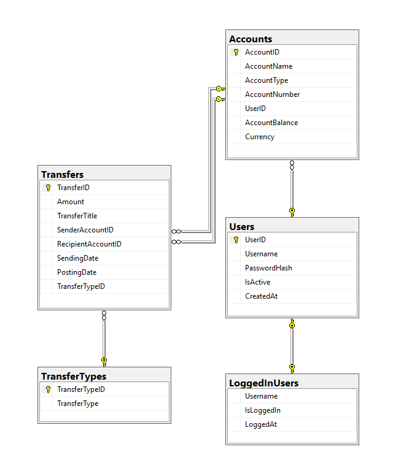
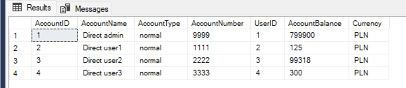
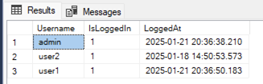
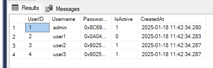
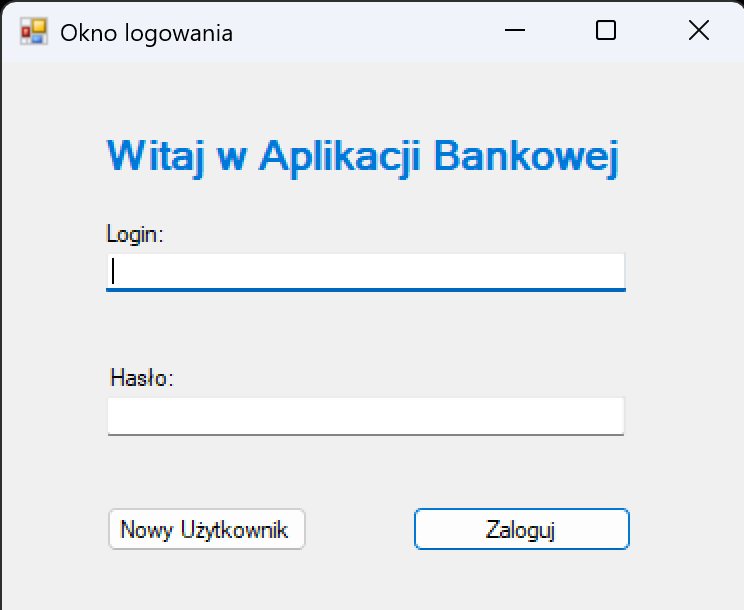
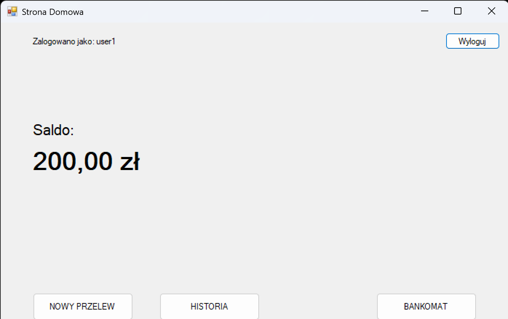
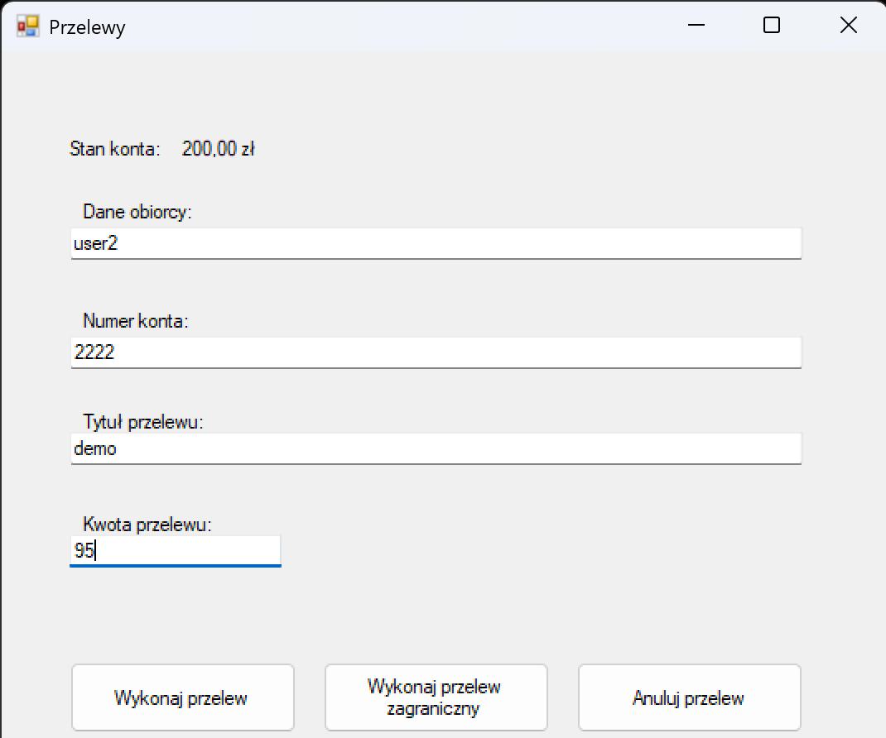
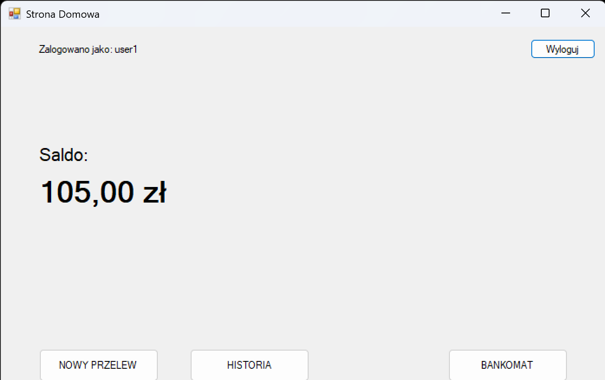
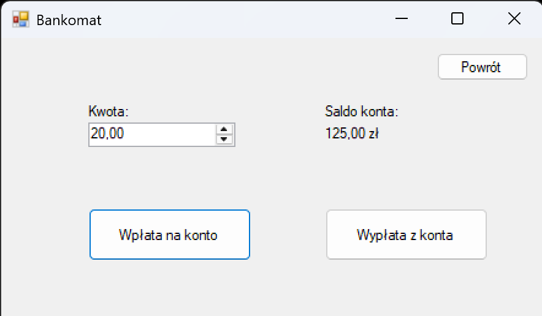
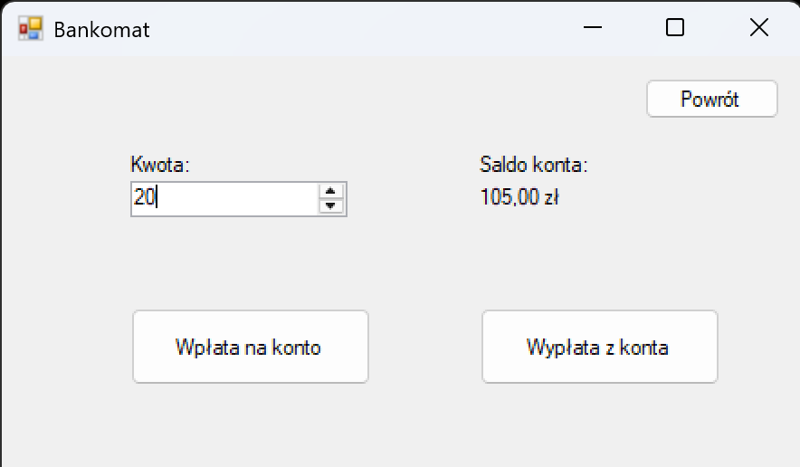

# Aplikacja Bankowa

## Funkcjonalności:
- Logowanie (użytkownik, hasło)
- ~~Zakładanie nowego użytkownika~~
- Przelew zwykły
- ~~Walidacja przelewów powyżej 15 tys Euro~~
- ~~Historia przelewów~~
- Wpłata/wypłata z bankomatu

## Baza (Tabele):
- 'users': id, login, password, user_type(admin/user), is_active, create_date
- 'accounts': id, account_name, account_type, account_number, user_id, account_balance, currency
- 'transfers': id, amount, transfer_title, sender_account_id, recipient_account_id, sending_date, posting_date, transfer_type
- 'transfer_types': id, transfer_type (Wpłata_gotówki, wypłata_gotówki, przelewy_krajowy)
- 'loggedInUsers': Username, IsLoggedIn, LoggedAt

Diagram bazy danych, powiązania pomiędzy tabelami - klucze

Tabela accounts

Tabela loggedInUsers

Tabela users

## Widoki użytkownika:
- okno logowania
- ~~rejestracja~~
- strona domowa (po zalogowaniu): przywitanie, saldo, ostatnie przelewy, wykonaj przelew, otwórz historię
- ~~historia~~
- przelewy
- bankomat

## Widoki admina:
- okno logowania
- ~~strona domowa: walidacja przelewów, użytkownicy~~
- ~~lista użytkowników (widok admina)~~
- ~~lista przelewów do zatwierdzenia~~
- ~~walidacja nowych użytkowników~~

## Technologie:
- C#
- SQL Server
- WinForms

## Setup Database

- Instalacja sqlexpress 2022 [download](https://www.microsoft.com/en-us/sql-server/sql-server-downloads?msockid=2099d0b1a47466a23918c5f7a55667d1)
- Zainstaluj SSMS [download](https://learn.microsoft.com/en-us/sql/ssms/download-sql-server-management-studio-ssms?view=sql-server-ver16)
- Uruchom SSMS i połącz z serwerem SQL `.\SQLEXPRESS`
- Otwórz i uruchom kwerendy z pliku setup-database-bank-application.sql w SSMS
- aktualizacja bazy uruchom kwerendy z pliku delete-database-bank-application.sql w SSMS
- ponownie uruchom kwerendy z pliku setup-database-bank-application.sql w SSMS

## Zrealizowano
- okno logowania
- przelewy
- bankomat
- Przelew zwykły
- Wpłata/wypłata z bankomatu
- strona domowa (po zalogowaniu): przywitanie, saldo, ostatnie przelewy, wykonaj przelew, otwórz historię
- przelewy
- bankomat
- okno logowania

Widok logowania

Widok główny - przed przelewem demo

Widok przelewu - przelew demo

Widok główny - po przelewie demo

Widok bankomat - przed wpłatą

Widok bankomat - po wpłacie

## Plany na rozwój aplikacji

- Zakładanie nowego użytkownika
- Walidacja przelewów powyżej 15 tys Euro
- Walidacja przelewów powyżej 15 tys Euro
- Historia przelewów
- strona domowa: walidacja przelewów, użytkownicy
- lista użytkowników (widok admina)
- lista przelewów do zatwierdzenia
- walidacja nowych użytkowników
- rejestracja
- historia

# Podsumowanie
Projekt aplikacji bankowej, zrealizowany przy użyciu technologii C#, SQL Server i WinForms, skupia się na podstawowych funkcjonalnościach bankowych. Do tej pory zaimplementowano kluczowe moduły, takie jak logowanie, obsługa przelewów, operacje bankomatowe (wpłaty i wypłaty), oraz stronę domową, która wyświetla saldo i umożliwia realizację przelewów.

Struktura bazy danych obejmuje tabele użytkowników, kont, przelewów i ich typów, a także mechanizm śledzenia zalogowanych użytkowników. Projekt opiera się na dobrze przemyślanym diagramie ER, umożliwiającym łatwe rozwijanie aplikacji.

Plany na przyszłość obejmują rozszerzenie funkcjonalności o zakładanie nowych użytkowników, walidację przelewów powyżej 15 tys. euro, historię przelewów oraz zaawansowane widoki administracyjne, takie jak zarządzanie użytkownikami i weryfikacja transakcji.

## Obiektowść

Podczas pracy nad aplikacją bankową zastosowaliśmy podejście obiektowe, aby kod był czytelny, łatwy do zarządzania i rozbudowy. W ramach projektu utworzyliśmy kilka klas, które odpowiadają za różne aspekty działania aplikacji.

Jedną z kluczowych klas jest klasa Przelew, która reprezentuje ogólne cechy przelewu, takie jak kwota, tytuł przelewu, numer odbiorcy. Klasa ta rozszerza klasę PrzelewZagraniczny, która dodaje dodatkowe funkcjonalności.

Ponadto, stworzyliśmy klasy odpowiadające za użytkownika, połączenie z bazą danych itd..

Podejście obiektowe pozwoliło nam lepiej zorganizować kod i ułatwić dalszy rozwój aplikacji.